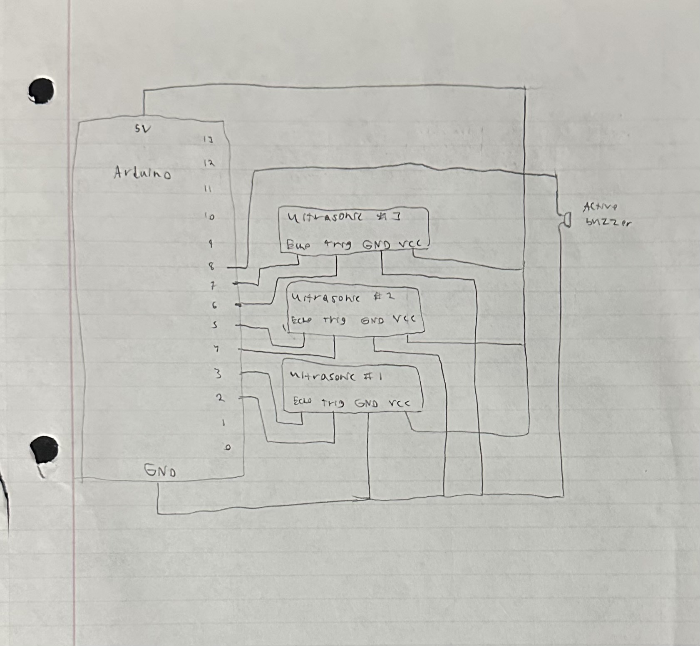
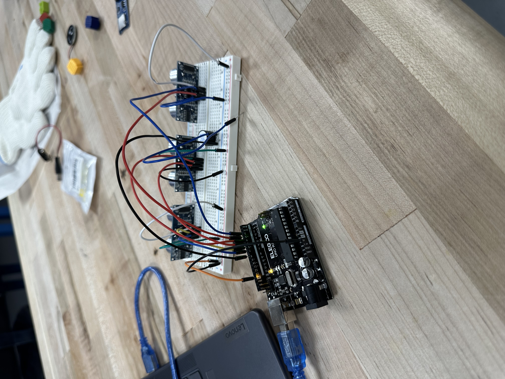

# arduino-glove-sensor
Assistive obstacle detection system designed to help visually impaired users detect nearby obstacles using ultrasonic sensors and audio feedback.

## Features
- Detects objects in front, left, and right directions
- Activates a buzzer when obstacles are detected
- Written in C++ using the Arduino framework

## Hardware
- Arduino board
- 3 Ultrasonic sensors
- Buzzer

## My Role 
- Programmed the Arduino in C++
- Implemented the sensor detection and buzzer feedback logic
- Collaborated with two teammates who built the glove and assembled the circuitry.

## Software
The Arduino code is written in **C++** using the Arduino IDE.

**Main Logic:**
- Each sensor checks for objects within 3 inches  
- The buzzer beeps once, twice, or three times, depending on which sensor detects an object
  
**Arduino File:** [rpina_Project_Design_Code](rpina_Project_Design_Code.ino)

## Project images

